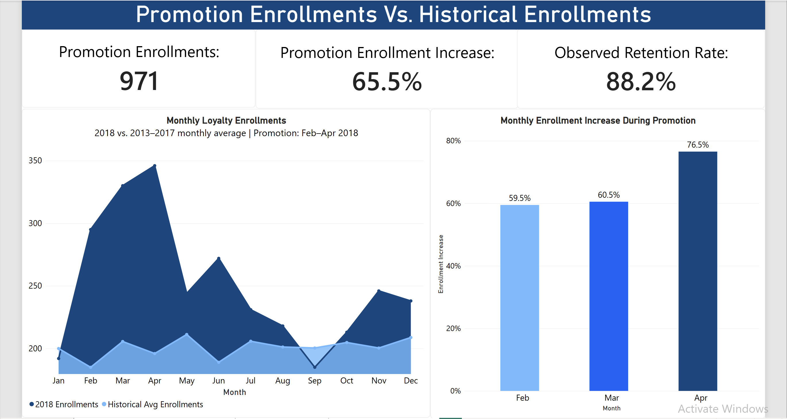

# northern-lights-air-loyalty-program
# Northern Lights Air Loyalty Program Analysis

## Project Overview

Northern Lights Air (NLA) is a fictional Canadian airline that ran a loyalty program promotion from **February through April 2018**.

The goal of this project was to evaluate the promotion by analyzing enrollment, customer retention, flight activity, loyalty points, and customer lifetime value (CLV). I also explored customer segments to identify patterns associated with higher customer value.

## Business Objective

Evaluate the effectiveness of NLA's 2018 loyalty promotion and better understand the customers participating in the loyalty program.

The analysis focused on:

- Did loyalty-program enrollment increase during the promotion?
- How well were promotion customers retained?
- How engaged were promotion customers after enrollment?
- How did their customer lifetime value compare with a historical cohort?
- Which customer segments were associated with higher CLV?

## Tools Used

- **SQL (SQLite)** — data validation, cleaning, cohort analysis, and KPI calculations
- **Power BI** — data modeling, DAX measures, and interactive dashboard development
- **Excel** — initial data exploration and validation
- **Python / Pandas / Jupyter Notebook** — data loading, SQL environment, and CSV preparation

---

# Analysis & Key Findings

## 1. Promotion Enrollment Performance

I compared February–April 2018 enrollment with the corresponding monthly averages from 2013–2017.

### SQL Highlight

```sql
WITH monthly_enrollment_counts AS (
    SELECT
        enrollment_month,
        enrollment_year,
        COUNT(*) AS number_of_enrollments
    FROM loyalty_history
    WHERE enrollment_month IN (2, 3, 4)
    GROUP BY enrollment_month, enrollment_year
)
SELECT
    enrollment_month,
    AVG(number_of_enrollments) AS historical_average
FROM monthly_enrollment_counts
WHERE enrollment_year BETWEEN 2013 AND 2017
GROUP BY enrollment_month;
```

### Key Insights

- **971 customers** enrolled during the 2018 promotion.
- Promotion-period enrollment was **65.5% higher** than the historical February–April average.
- February enrollment increased **59.5%**, March **60.5%**, and April **76.5%** compared with their 2013–2017 monthly averages.
- **88.2%** of promotion customers had no recorded cancellation.

### Dashboard



---

## 2. Customer Engagement

To compare engagement fairly, I compared the **2018 Promotion cohort** with customers who enrolled during **February–April 2017**.

Flight activity was measured from the customer's enrollment month through eight months after enrollment.

### SQL Highlight

```sql
WITH clean_flight_activity AS (
    SELECT DISTINCT *
    FROM flight_activity
)
SELECT
    enrollment_year,
    COUNT(DISTINCT loyalty_history.loyalty_number) AS customers,
    SUM(clean_flight_activity.total_flights) AS total_flights,
    SUM(clean_flight_activity.total_flights) * 1.0 /
        COUNT(DISTINCT loyalty_history.loyalty_number)
        AS avg_flights_per_customer
FROM loyalty_history
LEFT JOIN clean_flight_activity
    ON loyalty_history.loyalty_number =
       clean_flight_activity.loyalty_number
WHERE
    (
        (enrollment_year = 2017 AND enrollment_month IN (2,3,4))
        OR enrollment_type = '2018 Promotion'
    )
    AND (
        (clean_flight_activity.year - enrollment_year) * 12
        + (clean_flight_activity.month - enrollment_month)
    ) BETWEEN 0 AND 8
GROUP BY enrollment_year;
```

### Key Insights

- Promotion customers averaged approximately **41.8 flights per customer**, compared with **13.9** for the 2017 comparison cohort.
- This represents approximately **199.9% higher flight activity per customer**.
- Promotion customers accumulated approximately **93.8K points per customer**, compared with **20.8K** for the comparison cohort.
- Average points accumulated were **351.3% higher**.
- Points redeemed remained very similar: approximately **333.2 vs. 327.1 points per customer**.

### Dashboard


---

## 3. Customer Value & Segmentation

I analyzed Customer Lifetime Value to determine whether promotion customers differed in value and to identify customer segments associated with higher CLV.

### DAX Highlight

```DAX
Avg CLV =
AVERAGE(loyalty_history[clv])

CLV Increase % =
DIVIDE(
    [2018 Promo Avg CLV] - [2017 Comparison Avg CLV],
    [2017 Comparison Avg CLV]
)
```

### Key Insights

- The 2018 Promotion cohort had an average CLV of approximately **$8,046**, compared with **$7,435** for the 2017 comparison cohort.
- Promotion customers therefore had **8.2% higher average CLV**.
- **Aurora** loyalty-card customers had the highest average CLV at approximately **$10.7K**, followed by Nova at **$8.0K** and Star at **$6.7K**.
- CLV varied relatively little across education groups, while geographic analysis showed some variation across provinces.

### Dashboard


---

# Data Cleaning & Validation

Before analysis, I performed several data-quality checks:

- Confirmed **16,737 unique loyalty customers**.
- Identified **1,922 redundant exact flight-activity rows** and removed them using `SELECT DISTINCT`.
- Verified that some repeated customer-month records represented legitimate separate flight activity and should not be removed.
- Identified missing salary values and retained them as NULL rather than treating missing salary as zero.
- Interpreted missing cancellation dates as **no recorded cancellation** rather than deleting those customers.
- Verified that available flight activity covered **2017–2018**, which determined the historical cohort used for engagement comparisons.

---

# Conclusion

The February–April 2018 promotion coincided with substantially higher loyalty enrollment compared with historical monthly averages. Customers acquired during the promotion also showed higher flight activity, points accumulation, and average CLV than the February–April 2017 comparison cohort.

However, points redemption remained nearly unchanged despite substantially higher points accumulation. Loyalty-card tier also showed a clear relationship with customer value, with Aurora customers having the highest average CLV.

These findings suggest that future loyalty analysis should consider both **customer acquisition and post-enrollment behavior**, rather than evaluating promotions solely by the number of new members.

> **Note:** This analysis is observational. Differences between the 2018 Promotion cohort and historical customers should be interpreted as associations rather than proof that the promotion caused the observed changes.
